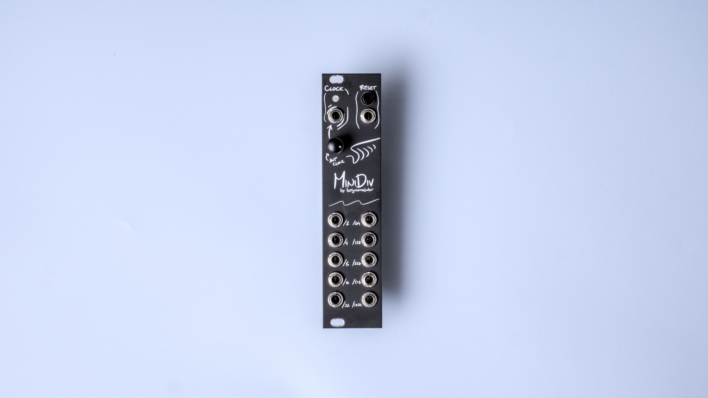
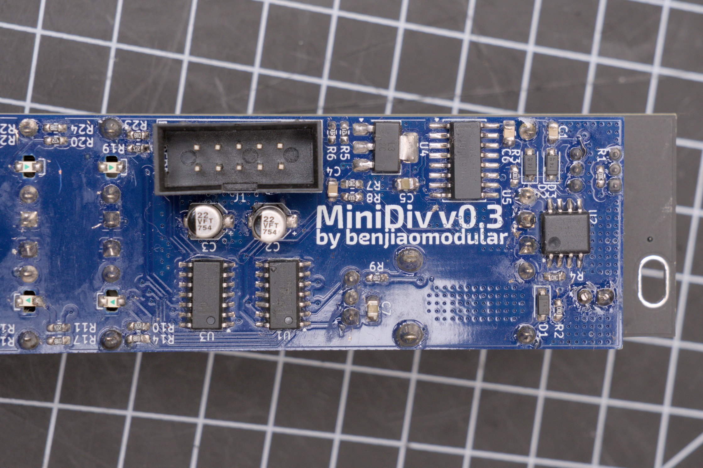
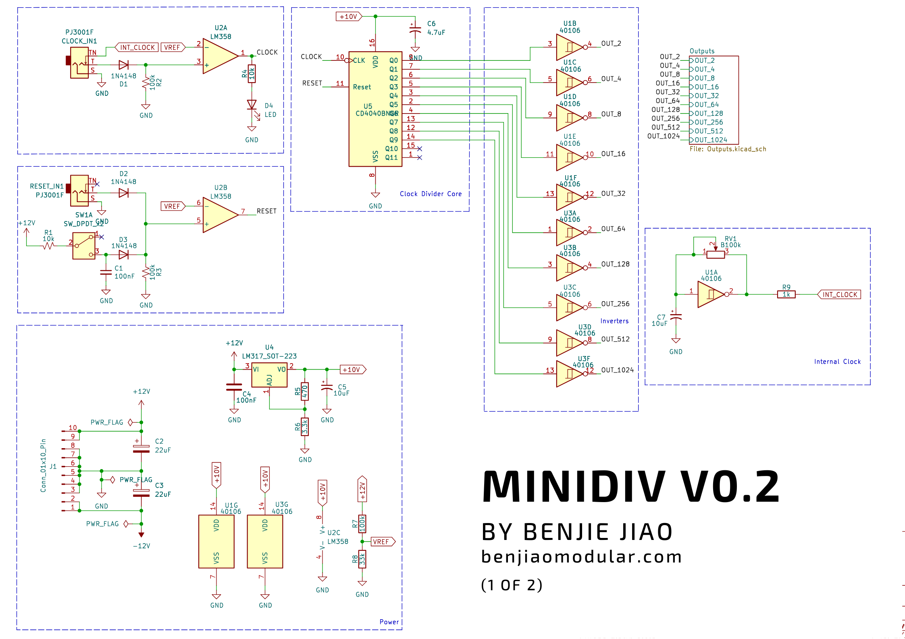
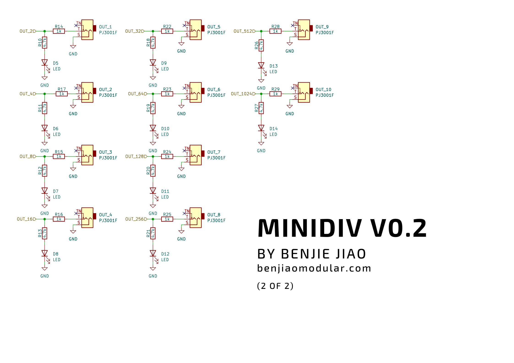
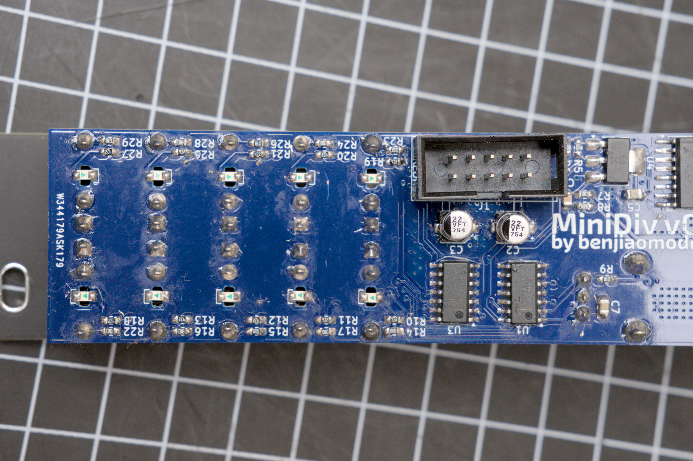

# MiniDiv
[![CC BY-SA 4.0][cc-by-sa-shield]][cc-by-sa]

A simple clock divider based on [HAGIWO's  design](https://note.com/solder_state/n/n7979cda44dcb).

## Schematics

Project sponsored by [PCBWay](https://pcbway.com).

See my full docs on my website: https://benjiaomodular.com/post/2024-11-22-minidiv-pcb/

## Versions
#### v0.3 - Fixed LED clearance issue
- To address LED clearance issues, I moved the LEDs to be mounted to the back, facing down, such that the LED shines through a hole on the board. 

#### v0.2 - Initial release
- First working version
- ISSUE: The LEDs were preventing the jacks from going in completly. The module still works but it might cause problems in the future.

## License

This work is licensed under a
[Creative Commons Attribution-ShareAlike 4.0 International License][cc-by-sa].

[![CC BY-SA 4.0][cc-by-sa-image]][cc-by-sa]

[cc-by-sa]: http://creativecommons.org/licenses/by-sa/4.0/
[cc-by-sa-image]: https://licensebuttons.net/l/by-sa/4.0/88x31.png
[cc-by-sa-shield]: https://img.shields.io/badge/License-CC%20BY--SA%204.0-lightgrey.svg
