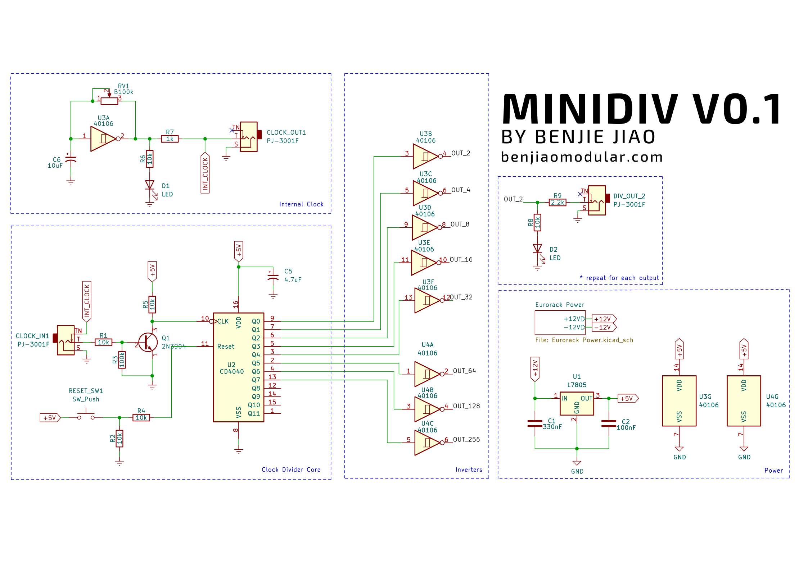

# MiniDiv
A simple clock divider based on [HAGIWO's  design](https://note.com/solder_state/n/n7979cda44dcb).

Project sponsored by [PCBWay](https://pcbway.com).

See my full docs on my website: https://benjiaomodular.com/post/2023-09-11-minidiv/